<h1 align="center">
  DKForge Business – Free Keycloak Login Theme
</h1>


<p align="center">
  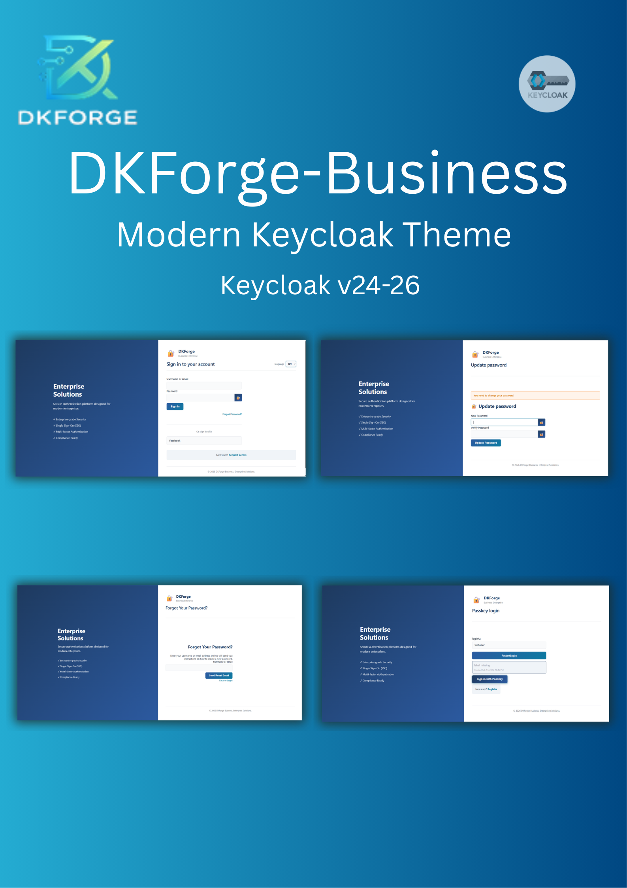
</p>

---

**DKForge Business – Free Keycloak Theme** is a clean and modern **Keycloak login theme** built for business and enterprise authentication use cases.

This theme is ideal for:
- Internal company systems
- SaaS dashboards
- Enterprise authentication portals
- Development & staging environments

This repository provides a **fully functional free theme** (not a demo), suitable for real projects and production testing.

---


## ✨ Features

### 🔐 Login Theme
- Fully customized Login pages (FTL + CSS)
- Username / Email login
- Password login with visibility toggle
- Registration page
- Forgot / Reset password pages
- OTP / TOTP configuration pages
- WebAuthn authentication pages
- Error & status pages

### ✉️ Email Theme
- Styled email templates
- Password reset email
- Email verification
- Consistent branding with login theme

### 🎨 Design & UX
- Enterprise-style design
- Responsive layout (desktop & mobile)
- Customizable colors, fonts, and branding
- Clean and accessible UI

### ⚙️ Technical
- Optimized for production use
- Compatible with modern Keycloak versions (v24–26)

---


## 🖼 Preview

Below are real screenshots taken from a running Keycloak instance using this theme.

- **Login ftl**

    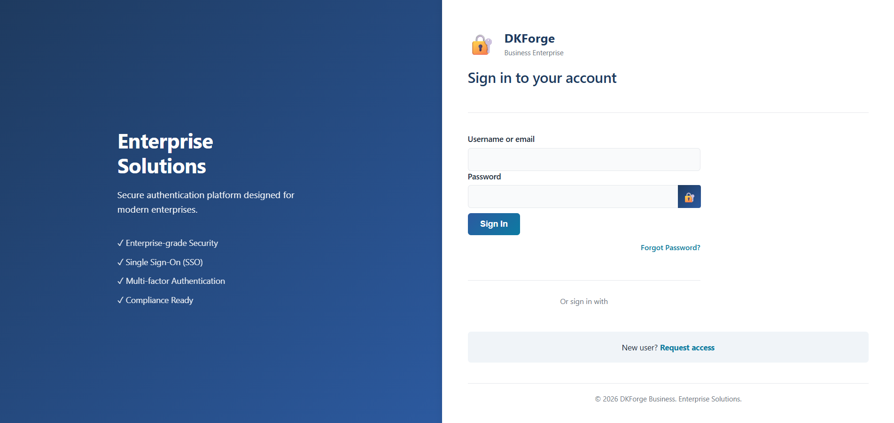

- **Register ftl**

    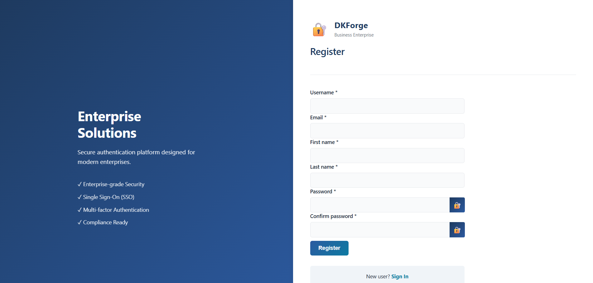

- **Login Update Password ftl**

    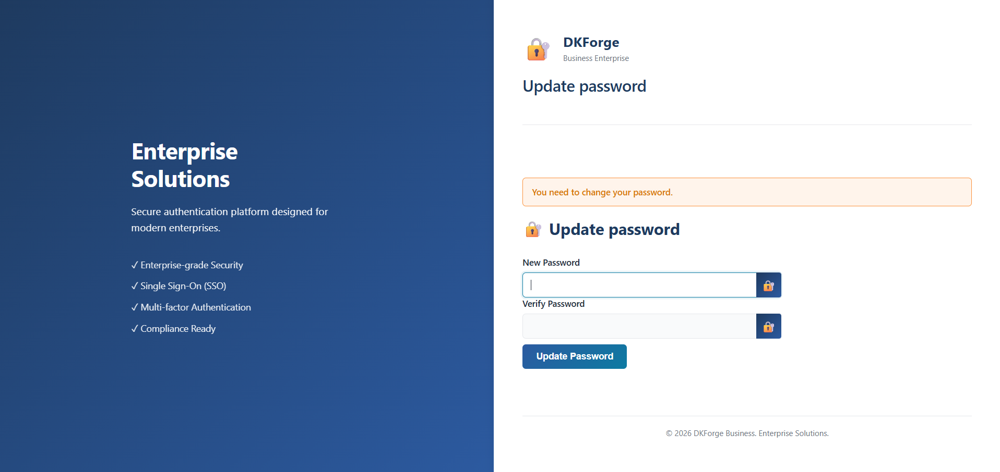

- **Email Template - Reset Password**

    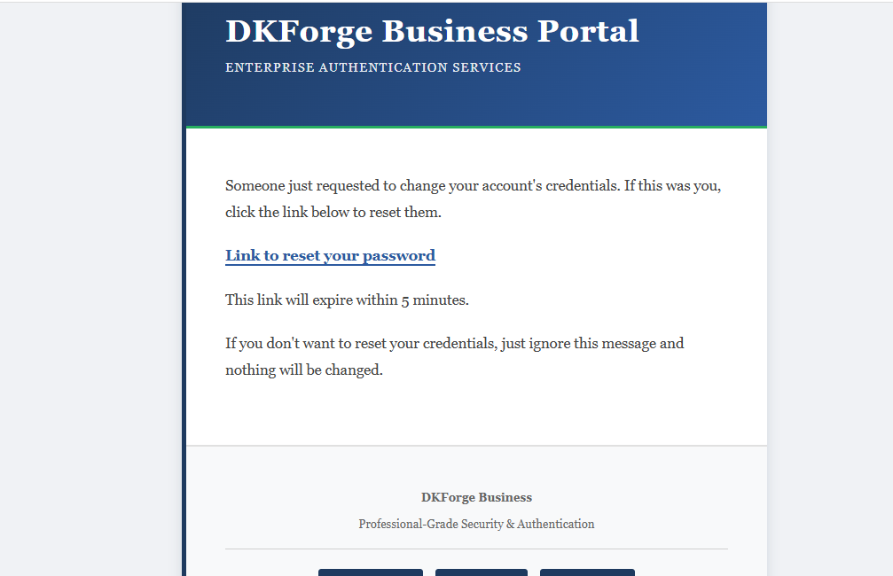

- **Email Verification Template**

    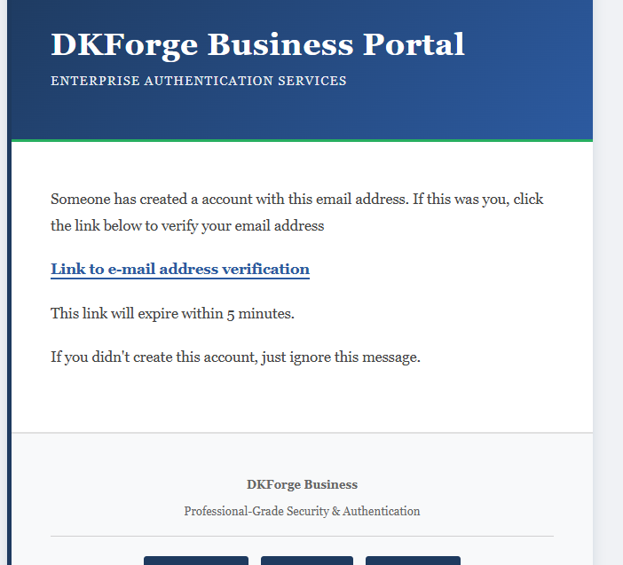

- **Webauthn Authenticate ftl**

    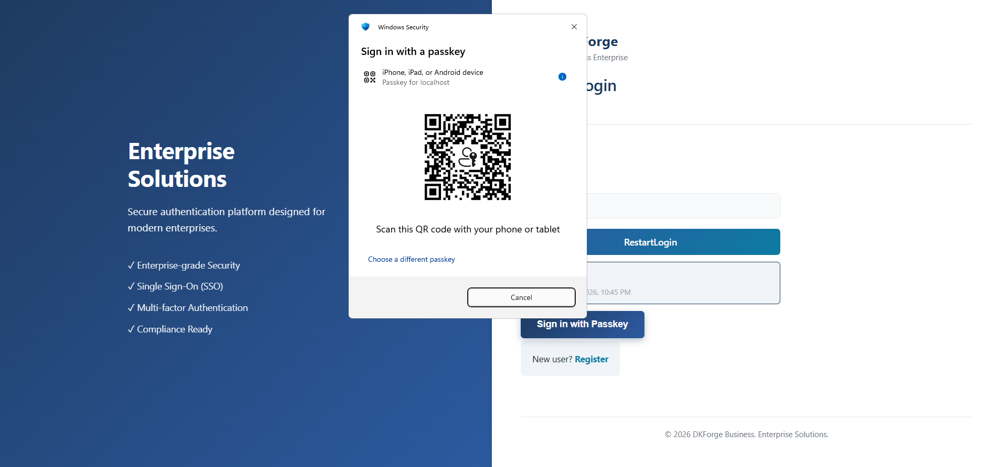


- **Login Config Totp ftl**

    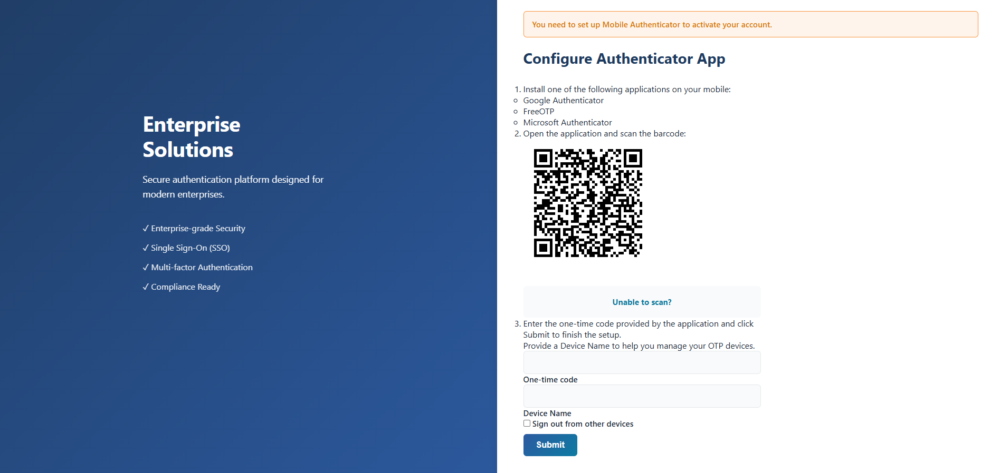

---

## 🚀 Installation (Basic)

> **Tested with Keycloak 26.4.7.**

1. Copy the `DKForge-Business` folder into:

```bash
keycloak/themes/
```

2. Restart Keycloak
3. Select **DKForge-Business** for `Login theme` and `Email theme` from the Keycloak Admin Console:
- **Realm Settings → Themes**

- **Login Theme** : DKForge-Business
- **Email theme** : DKForge-Business

    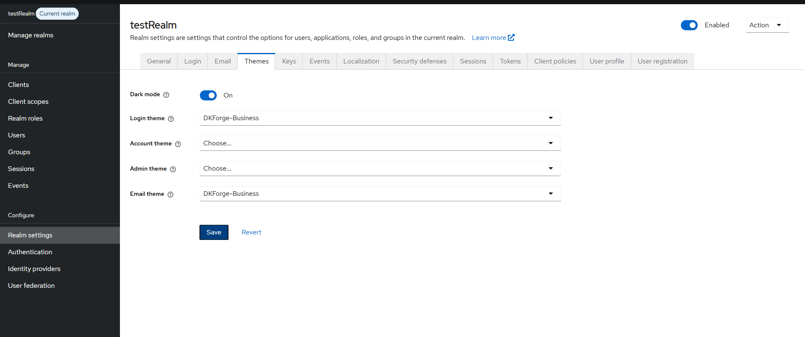
---

## 🐳 Run locally with Docker (Optional)

This repository includes **two Docker Compose files** for local preview and development:

- `docker-compose.yml` → Keycloak only (minimal)
- `docker-compose.mailhog.yml` → Keycloak + MailHog (email preview)

---

### 1) Start Keycloak (minimal)

From the project root (where `docker-compose.yml` exists):

```bash
docker-compose up -d
```

If your system uses Docker Compose v2:

```bash
docker compose up -d
```

`Keycloak` will be available at:

`http://localhost:8082`

Admin credentials (as defined in the compose file):

**Username:** `admin`

**Password:** `admin`

### 2) Start Keycloak + MailHog (email preview)

```bash
docker-compose -f docker-compose.mailhog.yml up -d
```

Docker Compose v2 alternative:

```bash
docker compose -f docker-compose.mailhog.yml up -d
```

`MailHog UI` will be available at:

`http://localhost:8025`

## ⚙️ Realm Setup (Themes + Email)

### A) Enable the DKForge theme

Keycloak Admin Console → **Realm Settings → Themes**

- **Login Theme**: DKForge-Business
- **Email Theme**: DKForge-Business

---

### B) Configure Email to use MailHog  
*(only if you started MailHog)*

> ℹ️ To test email delivery, the current user (e.g. `admin`) must have an email address configured.
>
> Go to:
> **Users → admin → Details → Email**
>
> Set any test email address (e.g. `test@mail.com`) and save.

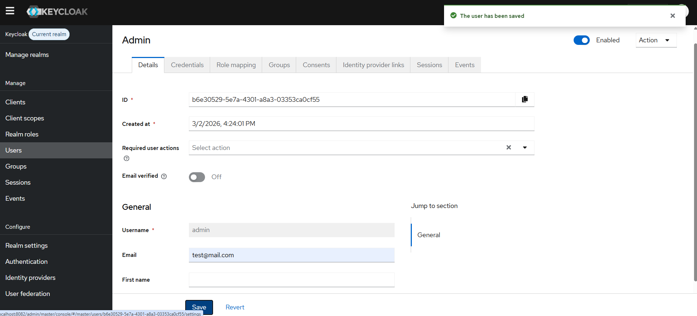

Keycloak Admin Console → **Realm Settings → Email**
- **From**(required): `no-reply@dkforge.local` (example)
- **Host**: `mailhog`
- **Port**: `1025`
- **Encryption**: `None`
- **Authentication**: `Off` (no username/password)

    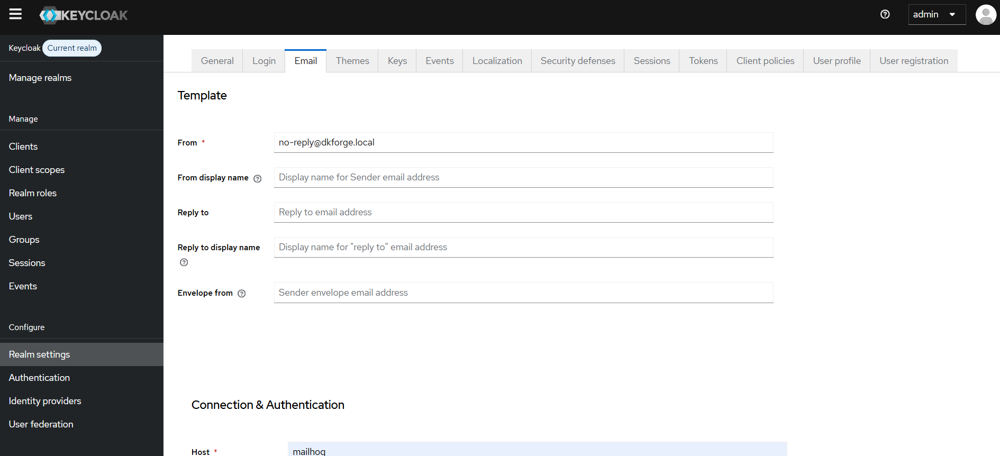
    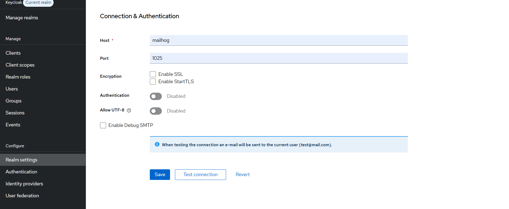

Click **Test Connection** to test the connection with MailHog.

If everything is configured correctly:
- A success message will appear in the top-right corner
- A test email will appear in the MailHog inbox
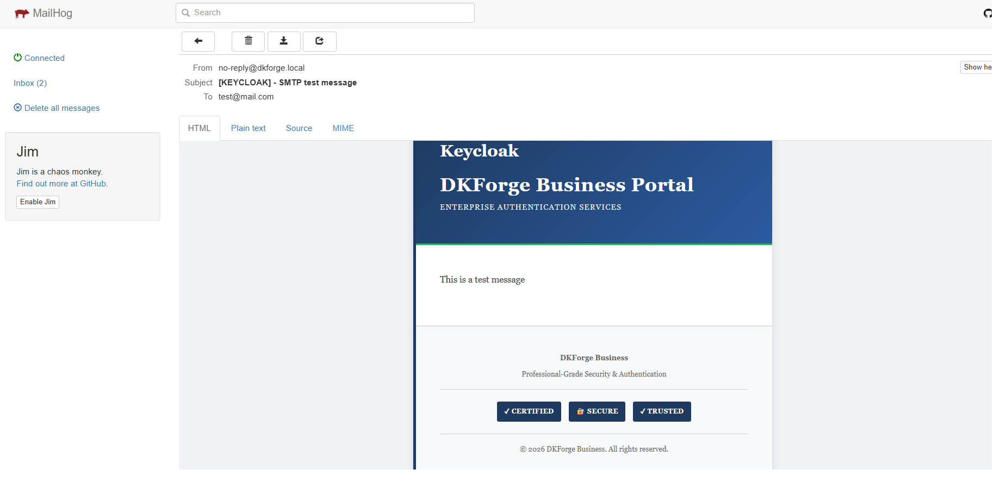

Click **Save**, then trigger an email action:

- Forgot Password (reset email)
- Verify Email (verification email)

Emails will appear in MailHog:

`http://localhost:8025`


> ℹ️ For testing purposes, you can apply the theme on the default realm.
> For production environments, it is recommended to use a dedicated realm.
> For production usage, replace MailHog settings with your real SMTP provider.

----
## 🧹 Stop / Reset

Stop containers:
- Minimal:

    ```bash
    docker-compose down
    ```
- MailHog:

    ```bash
    docker-compose -f docker-compose.mailhog.yml down
    ```
Fresh start (also removes volumes):

- Minimal:

    ```bash
    docker-compose down -v
    ```

- MailHog:

    ```bash
    docker-compose -f docker-compose.mailhog.yml down -v
    ```

> Tip: If you started the MailHog setup, always stop it using the same compose file:
> `docker-compose -f docker-compose.mailhog.yml down -v`
---

## 🎨 Customization

You may customize:
- Colors & fonts
- Logos & branding
- CSS styles
- Email templates

Advanced customization and documentation are available in the **commercial versions**.

---

## 📦 Commercial Versions

Advanced themes, bundles, extended customization guides, and commercial licenses are available on Gumroad.

👉 **[Get the full DKForge themes & bundles](https://gumroad.com/)**  
*(link will be updated)*

---

## 📄 License

This project is licensed under the **MIT License**.  
You are free to use, modify, and integrate this theme in personal or commercial projects.

---

## ⚠️ Disclaimer

This theme is provided **as-is**, without warranties.  
Compatibility with future Keycloak versions is not guaranteed.

---

## 👤 Author

**DKForge**  

---

> ℹ️ This theme customizes the **Login** and **Email** areas of Keycloak.
> The **Account Console** and **Admin Console** are not included.

